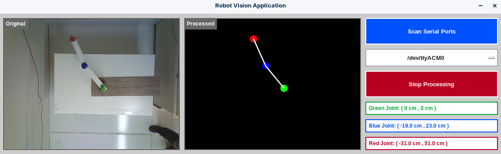

# OpenCV Vision for an Underactuated Robot Manipulator

This repository contains all the source code related to the computer-vision part of a academic research project for controlling an underactuated robot manipulator in years 2016 and 2017. The control algorithm of the robot is not provided is this repository.


## Old Versions

The v1, v2, and v3 versions of this project were written in Visual Studio using C# and [EmguCV](https://www.emgu.com/) and were hosted locally on my PC. I decided to put them in a GitHub repository in order to share it with other developers.

This is a screenshot of the GUI of old vision-based control app in Windows, written in Visual Studio.


And this is the another screenshot with image processing results:


## Current Development

Due to some limitations of C# and .NET for cross-platform application design and difficulties in using [OpenCV](https://opencv.org/) library I refactored the code and translated it to Python and used [Tkinter](https://docs.python.org/3/library/tkinter.html) for GUI design.

This is a screenshot of the GUI of new version in Linux, written in Python. (Robot joints positioning algorithm is not yet implemented.)



## Install dependencies

Python Version: 3.8.10

```console
pip install -r "./desktop_vision_app/requirements.txt"
```

## Tutorials

### Tkinter

- [Hello World in Tkinter](https://www.geeksforgeeks.org/hello-world-in-tkinter/)
- [Change the Tkinter Label Text](https://www.delftstack.com/howto/python-tkinter/how-to-change-the-tkinter-label-text/)
- [Tkinter Place](https://www.pythontutorial.net/tkinter/tkinter-place/)

### OpenCV + Tkinter

- [How display multi videos with threading using tkinter in python?](https://stackoverflow.com/questions/65876044/how-display-multi-videos-with-threading-using-tkinter-in-python)
- [Supercharge Your Classes With Python super()](https://realpython.com/python-super/)
- [Refresh Tkinter Widgets using after()](https://www.geeksforgeeks.org/python-after-method-in-tkinter/)