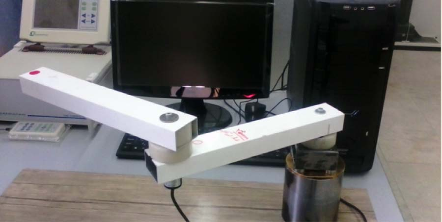
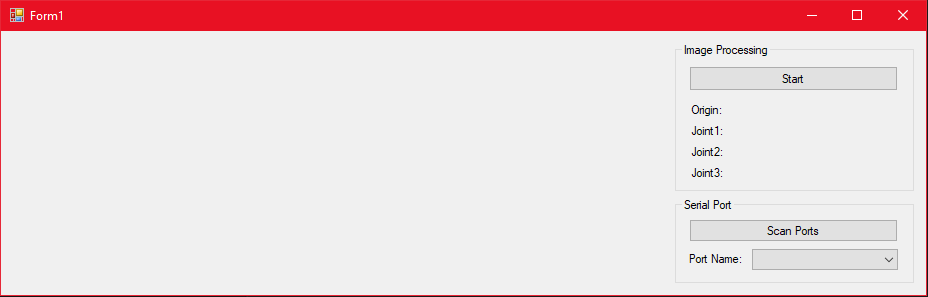
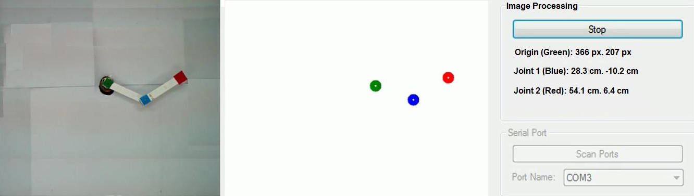

# Vision for Underactuated Robot Manipulator

This repository contains all the source code related to the computer-vision part of a academic research project for controlling an underactuated robot manipulator in years 2016 and 2017. The control algorithm of the robot is not provided is this repository.

The v1, v2, and v3 versions of this project were written in Visual Studio using C# and [EmguCV](https://www.emgu.com/) and were hosted locally on my PC. Now I decided to put them in a GitHub repository in order to share it with other developers.

This is a screenshot of the UI of our vision-based control app in Windows, written in Visual Studio.

And this is the another screenshot with image processing results:

Further development of this project tries to add this features:

- Refactor the code and use .NET 5.0
- Use a more flexible GUI framework like AvaloniaUI
- Write [OpenCV](https://opencv.org/) image processing code in C++ and call C++ function from C# (Instead of using wrappers of OpenCV for C# like EmguCV and OpenCvSharp)
